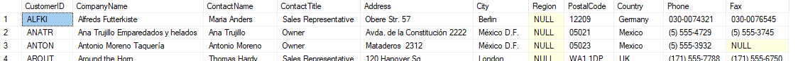
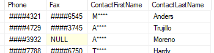

```{r setup, include=FALSE}
knitr::opts_chunk$set(echo = TRUE)
```

# Setup

I used the "Northwind" sample enterprise resource planning (ERP) database provided [here](https://github.com/Microsoft/sql-server-samples/tree/master/samples/databases/northwind-pubs) by Microsoft to demonstrate an array of SQL concepts below; with the full set of queries found at the bottom.

## Original Schema
\

# Cleaning Data

## Replacing Missing Data


After previewing the data, this is a simple query in which the 'Customers' table is filtered for NULL values in the 'PostalCode' column, which is then replaced with the correct data.

### [UPDATE]

```{sql eval = F}
SELECT *
FROM Customers
WHERE PostalCode IS NULL

UPDATE Customers
SET PostalCode = 'T45 HE16'
WHERE CustomerID = 'HUNGO'
```

## Protecting Sensitive Data

The 'Customers' table also contains information such as 'ContactName', 'Phone' and 'Fax'.
\

These are/may be personally identifiable information (PII) and thus should be protected. And while this can be done through the databases user access and roles;for the sake of this showcase I am going to add an extra layer of protection and masking the data as well.

Firstly, for the type of partial masking I want to apply it is necessary to split the 'ContactName' column into it's first and last name components.

### [ALTER | DROP]

```{sql eval = F}
ALTER TABLE Customers
ADD  ContactFirstName nvarchar(20), ContactLastName nvarchar(20)

Update Customers
SET ContactFirstName = TRIM(SUBSTRING(ContactName, 1, CHARINDEX(' ', ContactName)))

Update Customers
SET ContactLastName = TRIM(SUBSTRING(ContactName, CHARINDEX(' ', ContactName), LEN(ContactName)))

ALTER TABLE	Customers
DROP COLUMN ContactName
```

Then each of the columns containing sensitive data can be appropriately masked to partially obscure the information without completely redacting it.

### [MASKING]

```{sql eval = F}
ALTER TABLE Customers
ALTER COLUMN ContactFirstName ADD MASKED WITH (FUNCTION = 'partial(1, "****", 0)') 

ALTER TABLE Customers
ALTER COLUMN Phone	ADD MASKED WITH (FUNCTION = 'partial(0, "####", 4)') 

ALTER TABLE Customers
ALTER COLUMN Fax ADD MASKED WITH (FUNCTION = 'partial(0, "####", 4)') 
```

We can then test this by creating a user account without admin privileges to see how effective the masks are.

### [CREATE USER | GRANT access]

```{sql eval = F}
CREATE USER Tester WITHOUT LOGIN
GRANT SELECT ON SCHEMA::dbo to Tester

EXECUTE AS USER = 'Tester'
SELECT *
FROM Customers

```

\

## Converting Datatypes

In the 'Employees' table 'BirthDate' and 'HireDate' are stored as datetimes when just dates would do.

Firstly, the constraint on 'BirthDate', 'CK_BirthDate' must be dropped

### [DROP]

```{sql eval = F}
ALTER TABLE Employees
DROP CONSTRAINT CK_BirthDate
```

After which, the datatypes can be changed.

```{sql eval = F}
ALTER TABLE Employees
ALTER COLUMN BirthDate DATE 

ALTER TABLE Employees
ALTER COLUMN HireDate DATE 
```

And then the constraint can be reintroduced.

### [CONSTRAINT]

```{sql eval = F}
ALTER TABLE Employees
ADD CONSTRAINT "CK_Birthdate" CHECK (BirthDate < getdate())
```

## Renaming Table

The 'Order Details' table contains a space in the middle and although it isn't vital that this is changed it doesn't conform to the rest of the database's naming convention and thus is good practice to replace it with 'OrderDetails'.

### [EXEC]

```{sql eval = F}
exec sp_rename 'Order Details', 'OrderDetails' 
```


# Creating Tables

## Create Table
A 'Purchases' table is added for recording and tracking product restock orders. This was linked to the 'Products' table via a foreign key relationship on 'ProductID'. This is then indexed to speed up joins between 'Purchases' and 'Products'.

### [PRIMARY & FOREIGN KEYS | INDEXING]

```{sql eval = F}
CREATE TABLE Purchases
(
	PurchaseID int IDENTITY (1001, 1) PRIMARY KEY NOT NULL, 
	PurchaseDate date NOT NULL, 
	ProductID int NOT NULL, 
	Quantity int NOT NULL,
	UnitCost money NULL, 
	Received bit, 
	ReceivedDate date,
	CONSTRAINT FK_ProductID FOREIGN KEY(ProductID) REFERENCES Products(ProductID),
	INDEX Inx_ProductID_ProductBatches(ProductID)
)
```

A 'ProductBatches' table is added for recording and tracking product expiry dates. It is built using a composite key of 'PurchaseID' and 'ProductID' which are both foreign keys to 'Purchases' and 'Products' respectively and are indexed to speed up joins as such.

### [COMPOSITE KEY | INDEXING]

```{sql eval = F}

CREATE TABLE ProductBatches
(
	PurchaseID int NOT NULL, 
	ProductID int NOT NULL, 
	ExpiryDate date NOT NULL,
	BatchQuantity int,
	BatchNo int IDENTITY(100001, 1), 
	CONSTRAINT FK_ProductID_ProductBatches FOREIGN KEY(ProductID) REFERENCES Products(ProductID),
	CONSTRAINT FK_PurchaseID_ProductBatches FOREIGN KEY(PurchaseID) REFERENCES Purchases(PurchaseID),
	CONSTRAINT CK_PurchaseID_ProductID_ProductBatches PRIMARY KEY CLUSTERED (PurchaseID, ProductID),
	INDEX Inx_PurchaseID_ProductBatches(PurchaseID),
	INDEX Inx_ProductID_ProductBatches(ProductID)


```

## Updated Schema

\

## Populate New Tables

The purchases' table now needs back-populated based on the data in 'UnitsOnOrder' column in 'Products'.

### [INSERT INTO]
```{sql eval = F}
INSERT INTO Purchases(PurchaseDate, ProductID, Quantity, Received)
	SELECT
		GETDATE(),
		ProductID,
		UnitsOnOrder,
		0
	FROM Products
	WHERE UnitsOnOrder > 0
```

\

# Views

## View - Outstanding Orders 

A view for seeing the outstanding orders, and attaching related useful information from other tables such as 'Products', 'Customers', 'OrderDetails' and 'Shippers'.

### [VIEW | LEFT JOIN]

```{sql eval = F}
CREATE VIEW OutstandingOrders AS
	SELECT --TOP(99) PERCENT --Pre-Ordering Option
		Products.ProductName, 
		OrderDetails.Quantity, 
		Products.UnitsInStock,
		Customers.CompanyName CustomerCompany, 
		Orders.RequiredDate, 
		Orders.ShipVia, 
		Orders.ShipName, 
		Orders.ShipAddress, 
		Orders.ShipPostalCode, 
		Orders.ShipCity, 
		Orders.ShipRegion, 
		Orders.ShipCountry, 
		Shippers.CompanyName ShippingCompany, 
		Customers.Phone CustomerContactNumber,
		Shippers.Phone ShippingContactNumber
	FROM 
		Orders 
		LEFT JOIN Customers 
			ON Orders.CustomerID = Customers.CustomerID 
		LEFT JOIN OrderDetails 
			ON Orders.OrderID = OrderDetails.OrderID 
		LEFT JOIN Products 
			ON OrderDetails.ProductID = Products.ProductID
		LEFT JOIN Shippers 
			ON Orders.ShipVia = Shippers.ShipperID
	WHERE 
		Orders.ShippedDate IS NULL
	--ORDER BY RequiredDate, CustomerCompany DESC --Pre-Ordering Option
GO

SELECT * FROM OutstandingOrders
ORDER BY RequiredDate, CustomerCompany

```

\

## View - Expired Batches

A view for seeing which batches are past their expiry date using an inner join to also see the associated product name.

### [VIEW | INNER JOIN]

```{sql eval = F}
CREATE VIEW ExpiredBatches AS

	SELECT
		Products.ProductName,
		ProductBatches.ExpiryDate, 
		ProductBatches.BatchQuantity,
		ProductBatches.BatchNo,
		(ProductBatches.BatchQuantity * Products.UnitPrice) Subtotal
	FROM
		ProductBatches 
			INNER JOIN Products
				ON Products.ProductID = ProductBatches.ProductID
	WHERE ExpiryDate <= GETDATE()
			AND BatchQuantity > 0
GO

SELECT * FROM ExpiredBatches
```

\

# Functions

## Function - Stock Check

A scalar function that allows for a product name to be entered and the total number of units in stock of that item to be returned.

### [SCALAR FUNCTION]

```{sql eval = F}
CREATE FUNCTION InventoryCheck(@Product nvarchar(50))
RETURNS int AS 
BEGIN

	DECLARE @TotalStock int

	SELECT @TotalStock = SUM(UnitsInStock)
	FROM Products
	WHERE ProductName LIKE CONCAT('%', @Product, '%')

	RETURN @TotalStock

END
GO

SELECT dbo.InventoryCheck('Chai')
```

\

## Function - Batches Nearing Expiry

A tabular function that allows for a list of products to be entered and a table of the batches containing those items to be returned in order of nearest to farthest expiry date.

### [TABLE FUNCTION | SUBQUERY]

```{sql eval = F}
CREATE FUNCTION ExpiringBatches(@Products nvarchar(500))
RETURNS @Results TABLE
	(
		BatchNo int,
		ProductName nvarchar(50),
		BatchQuantity int,
		ExpiryDate date
	)
AS
BEGIN

DECLARE @LookupList TABLE(LookupItem nvarchar(50))

INSERT INTO @LookupList SELECT p.value FROM STRING_SPLIT(@Products, ',') p

INSERT INTO @Results
SELECT
	ProductBatches.BatchNo,
	Products.ProductName,
	ProductBatches.BatchQuantity,
	ProductBatches.ExpiryDate 
FROM ProductBatches
			INNER JOIN Products
				ON ProductBatches.ProductID = Products.ProductID
WHERE 
    EXISTS( SELECT * FROM @LookupList LL WHERE ProductName like '%'+ TRIM(LL.LookupItem) +'%' )
ORDER BY ExpiryDate
RETURN
END
GO

SELECT * FROM ExpiringBatches('Chang, Queso Cabrales')
SELECT * FROM ExpiringBatches('')
```

\
\

## Function - Sales Performance

A function that uses a common table expression (CTE) to return aggregated monthly sales data for each employee between given date parameters, and using case statements can be optionally ordered depending on another parameter.

### [TABLE FUNCTION | CTE | CASE WHEN | GROUP BY | ORDER BY | LEFT JOIN | AGGREGATED FUNCTIONS]

```{sql eval = F}
CREATE FUNCTION SalesPerformanceMonthly(@StartDate date, @EndDate date, @OrderBy nvarchar(50) = NULL)
RETURNS TABLE AS
RETURN(

-- Set up CTE with aggregated sales data for each employee and each month between the start and end date parameters
WITH CTE_MonthlySales AS(
			SELECT
				CONCAT(Employees.FirstName, ' ', Employees.LastName) TeamMember,
				COUNT(DISTINCT(Orders.OrderID)) MonthlyTotalSales,
				SUM(OrderDetails.Quantity * OrderDetails.UnitPrice) MonthlyTotalRevenue,
				CAST(DATEADD(MONTH, DATEDIFF(MONTH, 0, Orders.OrderDate), 0) as date) SalesMonth
			FROM 
				Employees
					INNER JOIN Orders
						ON Employees.EmployeeID = Orders.EmployeeID
					INNER JOIN OrderDetails
						ON Orders.OrderID = OrderDetails.OrderID
			WHERE
				Orders.OrderDate >= @StartDate 
				AND Orders.OrderDate <= @EndDate
			GROUP BY
				CONCAT(Employees.FirstName, ' ', Employees.LastName), DATEADD(MONTH, DATEDIFF(MONTH, 0, Orders.OrderDate), 0)
)

		-- 'Top 99 Percent' is to help the order by function; 
		-- AvgMonthlySales isn't aggregated using the AVG function so as to account for months with 0 sales
		SELECT TOP 99.99 PERCENT
			a.TeamMember TeamMember,
			a.TotalSales / DATEDIFF(MONTH, @StartDate, @EndDate) AvgMonthlySales,
			a.TotalRevenue / DATEDIFF(MONTH, @StartDate, @EndDate) AvgMonthlyRevenue,
			a.TotalSales TotalSales,
			a.TotalRevenue TotalRevenue,
			a.MaxMonthlySales MaxMonthlySales,
			string_agg(b.MMSDate, ' & ') MMSDate,
			a.MaxMonthlyRevenue MaxMonthlyRevenue, 
			c.MMRDate MMRDate
		FROM
			(
				SELECT
					TeamMember,
					SUM(MonthlyTotalSales) TotalSales,
					SUM(MonthlyTotalRevenue) TotalRevenue,
					MAX(MonthlyTotalSales) MaxMonthlySales,
					MAX(MonthlyTotalRevenue) MaxMonthlyRevenue
				FROM
					CTE_MonthlySales
				GROUP BY
					TeamMember
			) a
			-- Joins allow the finding of the month in which the employee had their highest sales/revenue
			LEFT JOIN
			(
				SELECT
					TeamMember,
					CONCAT(DATENAME(MONTH, SalesMonth), ' ', DATEPART(Year, SalesMonth)) MMSDate,
					MonthlyTotalSales
				FROM
					CTE_MonthlySales
			) b
				ON a.TeamMember = b.TeamMember
				AND a.MaxMonthlySales = b.MonthlyTotalSales
			LEFT JOIN
			(
				SELECT
					TeamMember,
					CONCAT(DATENAME(MONTH, SalesMonth), ' ', DATEPART(Year, SalesMonth)) MMRDate,
					MonthlyTotalRevenue
				FROM
					CTE_MonthlySales
			) c
				ON a.TeamMember = c.TeamMember
				AND a.MaxMonthlyRevenue = c.MonthlyTotalRevenue
		GROUP BY
			a.TeamMember,
			a.TotalSales,
			a.TotalRevenue,
			a.MaxMonthlySales,
			a.MaxMonthlyRevenue, 
			c.MMRDate

		-- Using seperate case statements for each data type handled to overcome a SQL bug
	 	ORDER BY 
			CASE 
				WHEN @OrderBy LIKE '%av%' AND @OrderBy LIKE '%sal%' THEN a.TotalSales / DATEDIFF(MONTH, @StartDate, @EndDate) 
				WHEN @OrderBy LIKE '%tot%' AND @OrderBy LIKE '%sal%' THEN a.TotalSales
				WHEN @OrderBy LIKE '%max%' AND @OrderBy LIKE '%sal%' THEN a.MaxMonthlySales
			END DESC,
			CASE
				WHEN @OrderBy LIKE '%av%' AND @OrderBy LIKE '%rev%' THEN a.TotalRevenue / DATEDIFF(MONTH, @StartDate, @EndDate)
				WHEN @OrderBy LIKE '%tot%' AND @OrderBy LIKE '%rev%' THEN a.TotalRevenue
				WHEN @OrderBy LIKE '%max%' AND @OrderBy LIKE '%rev%' THEN a.MaxMonthlyRevenue
			END DESC

)
GO

SELECT * FROM SalesPerformanceMonthly('01/01/2017', '01/01/2018', 'average revenue')

```

\


# Procedures

## Procedure - Purchase Received

An ACID procedure by which the arrival of a purchase can be logged just by entering the product name, quantity and expiry date of the delivery.

### [PROCEDURE | TRANSACTION | TRY CATCH | SUB-QUERY | LEFT JOIN]

```{sql eval = F}
CREATE PROCEDURE PurchaseReceived

	@ProductName nvarchar(100),
	@Quantity int,
	@ExpiryDate date

AS
BEGIN

    BEGIN TRANSACTION;
    SAVE TRANSACTION ChkPnt;

	BEGIN TRY
	UPDATE Purchases
	SET
		Purchases.Received = 1,
		Purchases.ReceivedDate = GETDATE()
	FROM 
		Purchases
			LEFT JOIN Products
				ON Purchases.ProductID = Products.ProductID
	WHERE 
		Products.ProductName LIKE '%' + @ProductName + '%'
			AND Purchases.Quantity = @Quantity
			AND Purchases.Received = 0
			AND Purchases.ReceivedDate IS NULL
			AND Purchases.PurchaseID = 
				(
					SELECT TOP(1) Purchases.PurchaseID 
					FROM Purchases 
						LEFT JOIN Products
							ON Purchases.ProductID = Products.ProductID
					WHERE Products.ProductName LIKE '%' + @ProductName + '%'
						AND Purchases.Quantity = @Quantity
						AND Purchases.Received = 0
						AND Purchases.ReceivedDate IS NULL
					ORDER BY PurchaseDate
				)

	UPDATE Products
	SET 
		Products.UnitsInStock = Products.UnitsInStock + Purchases.Quantity,
		Products.UnitsOnOrder = Products.UnitsOnOrder - Purchases.Quantity
	FROM 
		Products
			LEFT JOIN Purchases
				ON Products.ProductID = Purchases.ProductID
	WHERE 
		Products.ProductName LIKE '%' + @ProductName + '%'
			AND Purchases.Quantity = @Quantity
			AND Purchases.Received = 1
			AND Purchases.ReceivedDate = CAST(GETDATE() AS date)
			AND Purchases.PurchaseID = 
				(
					SELECT TOP(1) Purchases.PurchaseID 
					FROM Purchases 
						LEFT JOIN Products
							ON Purchases.ProductID = Products.ProductID
					WHERE Products.ProductName LIKE '%' + @ProductName + '%'
						AND Purchases.Quantity = @Quantity
						AND Purchases.Received = 1
						AND Purchases.ReceivedDate = CAST(GETDATE() AS date)
					ORDER BY PurchaseDate
				)

	INSERT INTO ProductBatches
		SELECT 
			Pur.PurchaseID,
			Pro.ProductID,
			@ExpiryDate,
			@Quantity
		FROM Purchases Pur
			LEFT JOIN Products Pro
				ON Pur.ProductID = Pro.ProductID
		WHERE Pro.ProductName LIKE '%' + @ProductName + '%'
			AND Pur.Quantity = @Quantity
			AND Pur.Received = 1
			AND Pur.ReceivedDate = CAST(GETDATE() AS date)
		ORDER BY PurchaseDate

	COMMIT TRANSACTION
	END TRY
	BEGIN CATCH
        IF @@TRANCOUNT > 0
        BEGIN
            ROLLBACK TRANSACTION ChkPnt
			SELECT 'Failed'
        END
    END CATCH
END
GO


exec PurchaseReceived 'Matjeshering', 30, '2017-03-08'
exec PurchaseReceived 'Chang', 40, '2017-03-08'
exec PurchaseReceived 'Queso Cabrales', 30, '2017-03-08'
```

\
\
\

## Procedure - Restock Check

A procedure that uses temporary tables to check for products whose stock have fallen bellow the 'ReorderLevel' and automatically fetches and sets information necessary for re-ordering the items.

### [PROCEDURE | TEMPORARY TABLE | TRANSACTION | TRY CATCH | IF | ALIASING | INNER & LEFT JOINS]

```{sql eval = F}
CREATE PROCEDURE AutoRestock
AS
BEGIN

    BEGIN TRANSACTION;
    SAVE TRANSACTION ChkPnt;

	BEGIN TRY
	DROP TABLE IF EXISTS #RestockNeeded
	CREATE TABLE #RestockNeeded
	(
		PurchaseDate date, 
		ProductID int, 
		Quantity int
	)

	INSERT INTO #RestockNeeded(PurchaseDate, ProductID, Quantity)
	SELECT
		GETDATE(),
		ProductID,
		2 * ReorderLevel
	FROM Products
	WHERE (UnitsInStock + UnitsOnOrder) <= ReorderLevel
		AND Discontinued = 0 


	INSERT INTO Purchases (PurchaseDate, ProductID, Quantity, Received)
	SELECT 
		PurchaseDate, 
		ProductID,
		Quantity,
		0
	FROM #RestockNeeded

	UPDATE Products
	SET
		UnitsOnOrder = UnitsOnOrder + R.Quantity
	FROM 
		Products P
			INNER JOIN #RestockNeeded R
				ON P.ProductID = R.ProductID
	
	SELECT 
		P.ProductName,
		R.Quantity,
		S.CompanyName,
		S.ContactTitle,
		S.ContactName,
		S.Phone,
		S.Fax,
		S.HomePage

	FROM #RestockNeeded R
	LEFT JOIN Products P
		ON R.ProductID = P.ProductID
	LEFT JOIN Suppliers S
		ON P.SupplierID = S.SupplierID

	COMMIT TRANSACTION
	END TRY
	BEGIN CATCH
        IF @@TRANCOUNT > 0
        BEGIN
            ROLLBACK TRANSACTION ChkPnt
			SELECT 'Failed'
        END
    END CATCH
END
Go

exec AutoRestock
```

\
\

# Full Queries Documentation

```{sql eval = F}
-- Initial Data Review

SELECT *
FROM Categories
-- Looks good.


SELECT *
FROM CustomerCustomerDemo
-- Empty table, many-many relationship link.


SELECT *
FROM CustomerDemographics
-- Empty table, should contain demographic groupings of the customer base, CHECK DATA IMPORTED CORRECTLY.
-- !Data import checked - correctly imported.!


SELECT *
FROM Customers
-- 'Region' non-standardised and missing data - should be fine as postal code will suffice.
-- 'PostalCode' Missing data for HUNGO.
-- 'Fax' missing data; acceptable, some companies may not still use fax.
-- Includes sensitive data, requires appropriate protection and handling.


SELECT *
FROM Employees
-- 'BirthDate' and 'HireDate' are stored as datetimes when just date would do.
-- 'Region' missing data.
-- Includes sensitive data, requires appropriate protection and handling.
-- Add monthly salary field.
-- Add holiday leave used field.
-- Add holiday leave total field.
-- Possible split into several tables (Office, HR, etc.).

SELECT *
FROM EmployeeTerritories
-- Looks good.


SELECT *
FROM [Order Details]
-- Remove space from 'Order Details' to conform to the rest of the database's naming convention.
-- Add a batches field


SELECT *
FROM Orders
-- 'OrderDate', 'RequiredDate' and 'ShippedDate' are datetimes, whereas dates would be cleaner.
-- 'ShippedDate' has missing values, likely to be from not having shipped yet but check to be sure.
-- 'Freight' should be renamed to 'FreightRate' so as to be more clear that it is the cost of shipping.


SELECT *
FROM Products
-- Add a purchase table, (PurchaseID, PurchaseDate, Product_ID, Quantity, UnitPrice, Sub-total, ShippingMethod, Received, ReceivedDate).
-- Add a batch table, (BatchID, PurchaseID, ProductID, ExpiryDate, UnitsRemaining).


SELECT *
FROM Region
-- Looks good.


SELECT *
FROM Shippers
-- Looks good.


SELECT *
FROM Suppliers
-- 'Fax' and 'HomePage' missing data; acceptable, some companies may not use fax / website.

SELECT *
FROM Territories


-- Add a General Ledger View
-- Add a Sales Performance View
-- Add an Oldest Batch Function


-- Clean Data

-- Customers Table
-- 'PostalCode' Missing data for HUNGO.
SELECT *
FROM Customers
WHERE CustomerID = 'HUNGO'

Update Customers
SET PostalCode = 'T45 HE16'
WHERE CustomerID = 'HUNGO'

SELECT *
FROM Customers
WHERE PostalCode is NULL
-- Cleaned

-- Includes sensitive data, requires appropriate protection and handling.
SELECT *
FROM Customers
-- 'ContactName', 'Phone' and 'Fax' are/may be PII (personally identifiable information) and should be protected.
-- For the sake of this showcase masking the data should suffice.

-- Split the first and last names.
ALTER TABLE Customers
ADD  ContactFirstName nvarchar(20), ContactLastName nvarchar(20)

Update Customers
SET ContactFirstName = TRIM(SUBSTRING(ContactName, 1, CHARINDEX(' ', ContactName)))
GO

Update Customers
SET ContactLastName = TRIM(SUBSTRING(ContactName, CHARINDEX(' ', ContactName), LEN(ContactName)))

ALTER TABLE	Customers
DROP COLUMN ContactName

-- Mask sensitive information.
ALTER TABLE Customers
ALTER COLUMN ContactFirstName ADD MASKED WITH (FUNCTION = 'partial(1, "****", 0)') 

ALTER TABLE Customers
ALTER COLUMN Phone	ADD MASKED WITH (FUNCTION = 'partial(0, "####", 4)') 

ALTER TABLE Customers
ALTER COLUMN Fax ADD MASKED WITH (FUNCTION = 'partial(0, "####", 4)') 

-- Check masking.
CREATE USER Tester WITHOUT LOGIN
GRANT SELECT ON SCHEMA::dbo to Tester

EXECUTE as USER = 'Tester'
SELECT *
FROM Customers

REVERT
-- Cleaned


-- Employees Table
-- 'BirthDate' and 'HireDate' are stored as datetimes when just date would do.
ALTER TABLE Employees
DROP CONSTRAINT CK_BirthDate

ALTER TABLE Employees
ALTER COLUMN BirthDate DATE 

ALTER TABLE Employees
ALTER COLUMN HireDate DATE 

ALTER TABLE Employees
ADD CONSTRAINT "CK_Birthdate" CHECK (BirthDate < getdate())
-- Cleaned


-- 'Region' missing data.
UPDATE Employees
SET Region = 'London'
WHERE City = 'London'
-- Cleaned

-- Includes sensitive data, requires appropriate protection and handling.
ALTER TABLE Employees
ALTER COLUMN FirstName ADD MASKED WITH (FUNCTION = 'partial(1, "****", 0)')

ALTER TABLE Employees
ALTER COLUMN BirthDate ADD MASKED WITH (FUNCTION = 'default()')

ALTER TABLE Employees
ALTER COLUMN HireDate ADD MASKED WITH (FUNCTION = 'default()')

ALTER TABLE Employees
ALTER COLUMN [Address] ADD MASKED WITH (FUNCTION = 'default()')

ALTER TABLE Employees
ALTER COLUMN PostalCode ADD MASKED WITH (FUNCTION = 'default()')

ALTER TABLE Employees
ALTER COLUMN HomePhone ADD MASKED WITH (FUNCTION = 'partial(0, "####", 4)')

ALTER TABLE Employees
ALTER COLUMN Photo ADD MASKED WITH (FUNCTION = 'default()')

ALTER TABLE Employees
ALTER COLUMN Notes ADD MASKED WITH (FUNCTION = 'default()')

ALTER TABLE Employees
ALTER COLUMN PhotoPath ADD MASKED WITH (FUNCTION = 'default()')

EXECUTE as USER = 'Tester'
SELECT *
FROM Employees

REVERT
-- Cleaned


-- Order Details Table
-- Remove space from 'Order Details' to conform to the rest of the database's naming convention.
exec sp_rename 'Order Details', 'OrderDetails' 
-- Cleaned


-- Orders Table
-- 'OrderDate', 'RequiredDate' and 'ShippedDate' are datetimes, whereas dates would be cleaner.
DROP INDEX Orders.OrderDate

ALTER TABLE Orders
ALTER COLUMN OrderDate DATE 

ALTER TABLE Orders
ALTER COLUMN RequiredDate DATE 

DROP INDEX Orders.ShippedDate

ALTER TABLE Orders
ALTER COLUMN ShippedDate DATE 

CREATE INDEX OrderDate
ON Orders (OrderDate)

CREATE INDEX ShippedDate
ON Orders (ShippedDate)
-- Cleaned

-- 'ShippedDate' has missing values, likely to be from not having shipped yet but check to be sure.
SELECT OrderID, OrderDate, RequiredDate, ShippedDate
FROM Orders
ORDER BY 3, 2, 4
-- Suspect orders haven't been shipped yet.

-- 'Freight' should be renamed to 'FreightRate' so as to be more clear that it is the cost of shipping.
EXEC sp_RENAME 'Orders.Freight' , 'FreightRate', 'COLUMN'
-- Cleaned


--Add Fields

-- Employees Table
-- Add monthly salary field.
ALTER TABLE Employees
ADD MonthlySalary money NOT NULL DEFAULT 0
-- Populate (Random data for the sake of showcase)
UPDATE Employees
SET MonthlySalary = (ROUND(abs(checksum(NewId())) / 100000 + 20000, -2))

-- Add holiday leave used field.
ALTER TABLE Employees
ADD HolidayLeaveUsed int NULL 
UPDATE Employees
SET HolidayLeaveUsed = (ROUND(abs(checksum(NewId())) / 100000000, 0))

-- Add holiday leave total field.
ALTER TABLE Employees
ADD HolidayLeaveTotal int NULL 
UPDATE Employees
SET HolidayLeaveTotal = 21


-- Create Tables


-- Add a purchase table, (PurchaseID, PurchaseDate, ProductID, Quantity, UnitPrice, Received, ReceivedDate).
CREATE TABLE Purchases
(
	PurchaseID int IDENTITY (1001, 1) PRIMARY KEY NOT NULL, 
	PurchaseDate date NOT NULL, 
	ProductID int NOT NULL, 
	Quantity int NOT NULL,
	UnitCost money NULL, 
	Received bit, 
	ReceivedDate date,
	CONSTRAINT FK_ProductID FOREIGN KEY(ProductID) REFERENCES Products(ProductID),
	INDEX Inx_ProductID_ProductBatches(ProductID)
)


-- Add a batch table, (BatchID, PurchaseID, ProductID, ExpiryDate, UnitsRemaining).
CREATE TABLE ProductBatches
(
	PurchaseID int NOT NULL, 
	ProductID int NOT NULL, 
	ExpiryDate date NOT NULL,
	BatchQuantity int,
	BatchNo int IDENTITY(100001, 1), 
	CONSTRAINT FK_ProductID_ProductBatches FOREIGN KEY(ProductID) REFERENCES Products(ProductID),
	CONSTRAINT FK_PurchaseID_ProductBatches FOREIGN KEY(PurchaseID) REFERENCES Purchases(PurchaseID),
	CONSTRAINT CK_PurchaseID_ProductID_ProductBatches PRIMARY KEY CLUSTERED (PurchaseID, ProductID),
	INDEX Inx_PurchaseID_ProductBatches(PurchaseID),
	INDEX Inx_ProductID_ProductBatches(ProductID)
)

 
 -- Fill New Tables

 -- Back-populate 'Purchases' with units in order in 'Products'
INSERT INTO Purchases(PurchaseDate, ProductID, Quantity, Received)
	SELECT
		GETDATE(),
		ProductID,
		UnitsOnOrder,
		0
	FROM Products
	WHERE UnitsOnOrder > 0

SELECT * FROM Purchases

-- Create Views

-- View Outstanding Orders

CREATE VIEW OutstandingOrders AS
	SELECT --TOP(99) PERCENT --Pre-Ordering Option
		Products.ProductName, 
		OrderDetails.Quantity, 
		Products.UnitsInStock,
		Customers.CompanyName CustomerCompany, 
		Orders.RequiredDate, 
		Orders.ShipVia, 
		Orders.ShipName, 
		Orders.ShipAddress, 
		Orders.ShipPostalCode, 
		Orders.ShipCity, 
		Orders.ShipRegion, 
		Orders.ShipCountry, 
		Shippers.CompanyName ShippingCompany, 
		Customers.Phone CustomerContactNumber,
		Shippers.Phone ShippingContactNumber
	FROM 
		Orders 
		LEFT JOIN Customers 
			ON Orders.CustomerID = Customers.CustomerID 
		LEFT JOIN OrderDetails 
			ON Orders.OrderID = OrderDetails.OrderID 
		LEFT JOIN Products 
			ON OrderDetails.ProductID = Products.ProductID
		LEFT JOIN Shippers 
			ON Orders.ShipVia = Shippers.ShipperID
	WHERE 
		Orders.ShippedDate IS NULL
	--ORDER BY RequiredDate, CustomerCompany DESC --Pre-Ordering Option
GO

SELECT * FROM OutstandingOrders
ORDER BY RequiredDate, CustomerCompany 


-- View Outstanding Purchases 

CREATE VIEW OutstandingPurchases AS
	SELECT 
		Products.ProductName, 
		Purchases.Quantity,
		Purchases.PurchaseDate,
		Suppliers.CompanyName Supplier,
		Suppliers.ContactTitle,
		Suppliers.ContactName, 
		Suppliers.Phone, 
		Suppliers.Fax,
		Suppliers.HomePage
	FROM 
		 Purchases 
			LEFT JOIN Products 
				ON Products.ProductID = Purchases.ProductID
			LEFT JOIN Suppliers
				ON Suppliers.SupplierID = Products.SupplierID
	WHERE 
		Purchases.Received = 0
GO

SELECT * FROM OutstandingPurchases
ORDER BY PurchaseDate, ProductName


-- Expired Batches

CREATE VIEW ExpiredBatches AS

	SELECT
		Products.ProductName,
		ProductBatches.ExpiryDate, 
		ProductBatches.BatchQuantity,
		ProductBatches.BatchNo,
		(ProductBatches.BatchQuantity * Products.UnitPrice) Subtotal
	FROM
		ProductBatches 
			INNER JOIN Products
				ON Products.ProductID = ProductBatches.ProductID
	WHERE ExpiryDate <= GETDATE()
			AND BatchQuantity > 0
GO

SELECT * FROM ExpiredBatches


-- Create Functions

-- Stock Check

CREATE FUNCTION InventoryCheck(@Product nvarchar(50))
RETURNS int AS 
BEGIN

	DECLARE @TotalStock int

	SELECT @TotalStock = SUM(UnitsInStock)
	FROM Products
	WHERE ProductName LIKE CONCAT('%', @Product, '%')

	RETURN @TotalStock

END
GO

SELECT dbo.InventoryCheck('Chai')


-- Batches Nearing Expiry

CREATE FUNCTION ExpiringBatches(@Products nvarchar(500))
RETURNS 
	@Results TABLE(
		BatchNo int,
		ProductName nvarchar(50),
		BatchQuantity int,
		ExpiryDate date
	)
AS
BEGIN

DECLARE @LookupList TABLE(LookupItem nvarchar(50))

INSERT INTO @LookupList SELECT p.value FROM STRING_SPLIT(@Products, ',') p

INSERT INTO @Results
SELECT
	ProductBatches.BatchNo,
	Products.ProductName,
	ProductBatches.BatchQuantity,
	ProductBatches.ExpiryDate 
FROM ProductBatches
			INNER JOIN Products
				ON ProductBatches.ProductID = Products.ProductID
WHERE 
    EXISTS( SELECT * FROM @LookupList LL WHERE ProductName like '%'+ TRIM(LL.LookupItem) +'%' )
ORDER BY ExpiryDate
RETURN
END
GO

SELECT * FROM ExpiringBatches('Chang, Queso Cabrales')
SELECT * FROM ExpiringBatches('')

-- Sales Peformance
CREATE FUNCTION SalesPerformanceMonthly(@StartDate date, @EndDate date, @OrderBy nvarchar(50) = NULL)
RETURNS TABLE AS
RETURN(

-- Set up CTE table with aggregated sales data for each employee and each month between the start and end date parameters
WITH CTE_MonthlySales AS(
			SELECT
				CONCAT(Employees.FirstName, ' ', Employees.LastName) TeamMember,
				COUNT(DISTINCT(Orders.OrderID)) MonthlyTotalSales,
				SUM(OrderDetails.Quantity * OrderDetails.UnitPrice) MonthlyTotalRevenue,
				CAST(DATEADD(MONTH, DATEDIFF(MONTH, 0, Orders.OrderDate), 0) as date) SalesMonth
			FROM 
				Employees
					INNER JOIN Orders
						ON Employees.EmployeeID = Orders.EmployeeID
					INNER JOIN OrderDetails
						ON Orders.OrderID = OrderDetails.OrderID
			WHERE
				Orders.OrderDate >= @StartDate 
				AND Orders.OrderDate <= @EndDate
			GROUP BY
				CONCAT(Employees.FirstName, ' ', Employees.LastName), DATEADD(MONTH, DATEDIFF(MONTH, 0, Orders.OrderDate), 0)
)

		-- 'Top 99 Percent' is to help the order by function; 
		-- AvgMonthlySales isn't aggregated using the AVG function so as to account for months with 0 sales
		SELECT TOP 99.99 PERCENT
			a.TeamMember TeamMember,
			a.TotalSales / DATEDIFF(MONTH, @StartDate, @EndDate) AvgMonthlySales,
			a.TotalRevenue / DATEDIFF(MONTH, @StartDate, @EndDate) AvgMonthlyRevenue,
			a.TotalSales TotalSales,
			a.TotalRevenue TotalRevenue,
			a.MaxMonthlySales MaxMonthlySales,
			string_agg(b.MMSDate, ' & ') MMSDate,
			a.MaxMonthlyRevenue MaxMonthlyRevenue, 
			c.MMRDate MMRDate
		FROM
			(
				SELECT
					TeamMember,
					SUM(MonthlyTotalSales) TotalSales,
					SUM(MonthlyTotalRevenue) TotalRevenue,
					MAX(MonthlyTotalSales) MaxMonthlySales,
					MAX(MonthlyTotalRevenue) MaxMonthlyRevenue
				FROM
					CTE_MonthlySales
				GROUP BY
					TeamMember
			) a
			-- Joins allow the finding of the month in which the employee had their highest sales/revenue
			LEFT JOIN
			(
				SELECT
					TeamMember,
					CONCAT(DATENAME(MONTH, SalesMonth), ' ', DATEPART(Year, SalesMonth)) MMSDate,
					MonthlyTotalSales
				FROM
					CTE_MonthlySales
			) b
				ON a.TeamMember = b.TeamMember
				AND a.MaxMonthlySales = b.MonthlyTotalSales
			LEFT JOIN
			(
				SELECT
					TeamMember,
					CONCAT(DATENAME(MONTH, SalesMonth), ' ', DATEPART(Year, SalesMonth)) MMRDate,
					MonthlyTotalRevenue
				FROM
					CTE_MonthlySales
			) c
				ON a.TeamMember = c.TeamMember
				AND a.MaxMonthlyRevenue = c.MonthlyTotalRevenue
		GROUP BY
			a.TeamMember,
			a.TotalSales,
			a.TotalRevenue,
			a.MaxMonthlySales,
			a.MaxMonthlyRevenue, 
			c.MMRDate

		-- Using seperate case statements for each data type handled to overcome a SQL bug
	 	ORDER BY 
			CASE 
				WHEN @OrderBy LIKE '%av%' AND @OrderBy LIKE '%sal%' THEN a.TotalSales / DATEDIFF(MONTH, @StartDate, @EndDate) 
				WHEN @OrderBy LIKE '%tot%' AND @OrderBy LIKE '%sal%' THEN a.TotalSales
				WHEN @OrderBy LIKE '%max%' AND @OrderBy LIKE '%sal%' THEN a.MaxMonthlySales
			END DESC,
			CASE
				WHEN @OrderBy LIKE '%av%' AND @OrderBy LIKE '%rev%' THEN a.TotalRevenue / DATEDIFF(MONTH, @StartDate, @EndDate)
				WHEN @OrderBy LIKE '%tot%' AND @OrderBy LIKE '%rev%' THEN a.TotalRevenue
				WHEN @OrderBy LIKE '%max%' AND @OrderBy LIKE '%rev%' THEN a.MaxMonthlyRevenue
			END DESC

)
GO

SELECT * FROM SalesPerformanceMonthly('01/01/2017', '01/01/2018', 'average revenue')


-- Create Procedures

-- Purchase Received

CREATE PROCEDURE PurchaseReceived

	@ProductName nvarchar(100),
	@Quantity int,
	@ExpiryDate date

AS
BEGIN

    BEGIN TRANSACTION;
    SAVE TRANSACTION ChkPnt;

	BEGIN TRY
	UPDATE Purchases
	SET
		Purchases.Received = 1,
		Purchases.ReceivedDate = GETDATE()
	FROM 
		Purchases
			LEFT JOIN Products
				ON Purchases.ProductID = Products.ProductID
	WHERE 
		Products.ProductName LIKE '%' + @ProductName + '%'
			AND Purchases.Quantity = @Quantity
			AND Purchases.Received = 0
			AND Purchases.ReceivedDate IS NULL
			AND Purchases.PurchaseID = 
				(
					SELECT TOP(1) Purchases.PurchaseID 
					FROM Purchases 
						LEFT JOIN Products
							ON Purchases.ProductID = Products.ProductID
					WHERE Products.ProductName LIKE '%' + @ProductName + '%'
						AND Purchases.Quantity = @Quantity
						AND Purchases.Received = 0
						AND Purchases.ReceivedDate IS NULL
					ORDER BY PurchaseDate
				)

	UPDATE Products
	SET 
		Products.UnitsInStock = Products.UnitsInStock + Purchases.Quantity,
		Products.UnitsOnOrder = Products.UnitsOnOrder - Purchases.Quantity
	FROM 
		Products
			LEFT JOIN Purchases
				ON Products.ProductID = Purchases.ProductID
	WHERE 
		Products.ProductName LIKE '%' + @ProductName + '%'
			AND Purchases.Quantity = @Quantity
			AND Purchases.Received = 1
			AND Purchases.ReceivedDate = CAST(GETDATE() AS date)
			AND Purchases.PurchaseID = 
				(
					SELECT TOP(1) Purchases.PurchaseID 
					FROM Purchases 
						LEFT JOIN Products
							ON Purchases.ProductID = Products.ProductID
					WHERE Products.ProductName LIKE '%' + @ProductName + '%'
						AND Purchases.Quantity = @Quantity
						AND Purchases.Received = 1
						AND Purchases.ReceivedDate = CAST(GETDATE() AS date)
					ORDER BY PurchaseDate
				)

	INSERT INTO ProductBatches
		SELECT 
			Pur.PurchaseID,
			Pro.ProductID,
			@ExpiryDate,
			@Quantity
		FROM Purchases Pur
			LEFT JOIN Products Pro
				ON Pur.ProductID = Pro.ProductID
		WHERE Pro.ProductName LIKE '%' + @ProductName + '%'
			AND Pur.Quantity = @Quantity
			AND Pur.Received = 1
			AND Pur.ReceivedDate = CAST(GETDATE() AS date)
		ORDER BY PurchaseDate

	COMMIT TRANSACTION
	END TRY
	BEGIN CATCH
        IF @@TRANCOUNT > 0
        BEGIN
            ROLLBACK TRANSACTION ChkPnt
			SELECT 'Failed'
        END
    END CATCH
END
GO


exec PurchaseReceived 'Matjeshering', 30, '2017-03-08'
exec PurchaseReceived 'Chang', 40, '2017-03-08'
exec PurchaseReceived 'Queso Cabrales', 30, '2017-03-08'


-- Restock Check

CREATE PROCEDURE AutoRestock
AS
BEGIN

    BEGIN TRANSACTION;
    SAVE TRANSACTION ChkPnt;

	BEGIN TRY
	DROP TABLE IF EXISTS #RestockNeeded
	CREATE TABLE #RestockNeeded
	(
		PurchaseDate date, 
		ProductID int, 
		Quantity int
	)

	INSERT INTO #RestockNeeded(PurchaseDate, ProductID, Quantity)
	SELECT
		GETDATE(),
		ProductID,
		2 * ReorderLevel
	FROM Products
	WHERE (UnitsInStock + UnitsOnOrder) <= ReorderLevel
		AND Discontinued = 0 


	INSERT INTO Purchases (PurchaseDate, ProductID, Quantity, Received)
	SELECT 
		PurchaseDate, 
		ProductID,
		Quantity,
		0
	FROM #RestockNeeded

	UPDATE Products
	SET
		UnitsOnOrder = UnitsOnOrder + R.Quantity
	FROM 
		Products P
			INNER JOIN #RestockNeeded R
				ON P.ProductID = R.ProductID
	
	SELECT 
		P.ProductName,
		R.Quantity,
		S.CompanyName,
		S.ContactTitle,
		S.ContactName,
		S.Phone,
		S.Fax,
		S.HomePage

	FROM #RestockNeeded R
	LEFT JOIN Products P
		ON R.ProductID = P.ProductID
	LEFT JOIN Suppliers S
		ON P.SupplierID = S.SupplierID

	COMMIT TRANSACTION
	END TRY
	BEGIN CATCH
        IF @@TRANCOUNT > 0
        BEGIN
            ROLLBACK TRANSACTION ChkPnt
			SELECT 'Failed'
        END
    END CATCH
END
Go

exec AutoRestock
```


